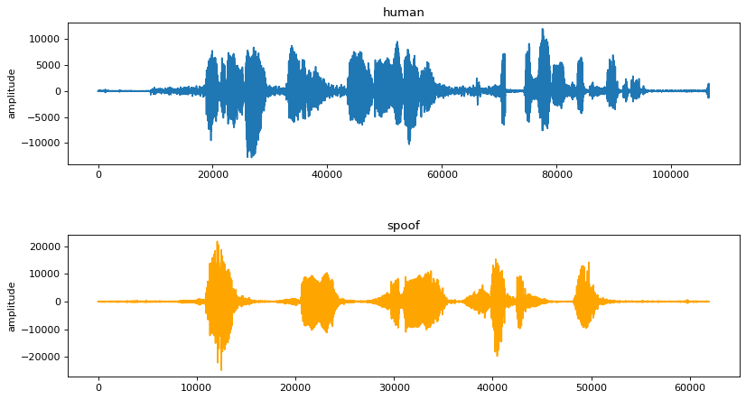

# Voice-antispoofing

Виртуальные ассистенты, устройства Internet-of-Things все больше входят в жизнь современного человека. Они не только помогают автоматизировать поисковые запросы, распознают лица и речь, выполняют простейшие команды, но и учатся вести мониторинг состояния здоровья, детектировать различные ситуации, информировать о важных для Пользователя событиях.

Для того, чтобы виртуальные ассистенты реагировали только на голос человека, присутствующего перед устройством, и не принимали во внимание речь из телевизора, радио, а также синтезированную, воспроизводимую роботами и другую, звучащую из динамиков, необходимы детекторы “живого” голоса.

Данная задача посвящена детектированию наличия “живого” голоса (класс 1) и его отделению от синтетического/конвертированного/перезаписанного голоса (класс 2).

Предлагается разработать систему с использованием элементов машинного обучения, которая обучается на заданной обучающей базе аудиозаписей и должна быть протестирована на тестовой базе аудиозаписей.

